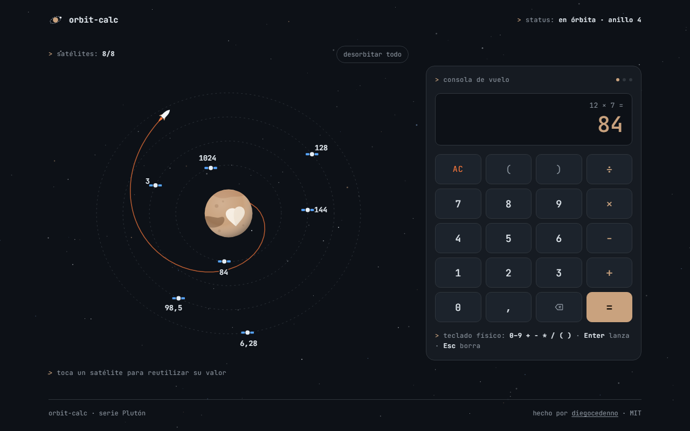

# orbit-calc

> A calculator with a spacecraft console: every result is launched into orbit and stays there as a satellite you can tap to reuse.
>
> Una calculadora con consola de nave: cada resultado se lanza a una órbita y queda como satélite que puedes tocar para reutilizarlo.

**[English](#english)** · **[Español](#español)**

---

## English

### What it does

- Type an expression with the on-screen console or your physical keyboard and press `Enter`.
- The result lifts off from Pluto on a small rocket, spirals outward and settles into one of four dashed orbits.
- Up to eight results stay in orbit as your history. Tap one — or focus it with `Tab` and press `Enter` — to drop its value back into the current expression.
- History survives a reload (`localStorage`).

### What makes it technically interesting

- **No `eval`.** Expressions go through a hand-written tokenizer and a recursive-descent parser with operator precedence, unary minus, powers, implicit multiplication (`2(3+4)`) and auto-closing parentheses.
- **Float noise handled.** Results are rounded to 12 significant digits, so `0,1 + 0,2` is `0,3`.
- **One animation loop, transforms only.** A single `requestAnimationFrame` drives every satellite; only `transform` is written per frame. The launch is a spiral with eased radius and angle, and the rocket's heading comes from its actual velocity vector.
- **The orbital plane adapts to the layout.** The scene measures its container and tilts the orbits (circles become ellipses) to fill whatever shape it gets, from a 360 px phone to a wide desktop.
- **Reduced motion is a first-class path.** With `prefers-reduced-motion`, the loop never starts: satellites sit still and new ones fade in.
- **Accessible SVG.** Satellites are focusable buttons with descriptive labels, results are announced through a live region, and orbits pause while you hover or focus them.
- **Zero dependencies, zero build.** Plain HTML, CSS and JavaScript. Fonts are bundled; nothing is requested from the network.

### Keyboard

| Key | Action |
| --- | --- |
| `0–9` `,` `.` | Digits and decimal separator |
| `+` `-` `*` `/` `^` `(` `)` | Operators and parentheses |
| `Enter` or `=` | Calculate and launch |
| `Backspace` | Delete last character |
| `Esc` or `Delete` | Clear |

### Run it

Double-click `index.html`. That is all — there is no build step and no server.
It also works as-is on GitHub Pages.

### License

[MIT](LICENSE) © Diego Cedeño. Inter and JetBrains Mono are bundled under the [SIL Open Font License](assets/fonts/).

---

## Español

### Qué hace

- Escribe una expresión con la consola en pantalla o con tu teclado físico y pulsa `Enter`.
- El resultado despega de Plutón en un pequeño cohete, sale en espiral y se asienta en una de cuatro órbitas punteadas.
- Hasta ocho resultados quedan en órbita como historial. Toca uno —o enfócalo con `Tab` y pulsa `Enter`— para devolver su valor a la expresión en curso.
- El historial sobrevive a una recarga (`localStorage`).

### Qué lo hace interesante técnicamente

- **Sin `eval`.** Las expresiones pasan por un tokenizador propio y un parser de descenso recursivo con precedencia de operadores, menos unario, potencias, multiplicación implícita (`2(3+4)`) y cierre automático de paréntesis.
- **Ruido de coma flotante controlado.** Los resultados se redondean a 12 cifras significativas: `0,1 + 0,2` da `0,3`.
- **Un solo bucle de animación, solo transforms.** Un único `requestAnimationFrame` mueve todos los satélites y solo escribe `transform` en cada frame. El lanzamiento es una espiral con radio y ángulo suavizados, y el rumbo del cohete sale de su vector de velocidad real.
- **El plano orbital se adapta al layout.** La escena mide su contenedor e inclina las órbitas (los círculos pasan a elipses) para llenar la forma que le toque, desde un móvil de 360 px hasta un escritorio ancho.
- **El movimiento reducido es un camino de primera clase.** Con `prefers-reduced-motion` el bucle no arranca: los satélites quedan quietos y los nuevos aparecen con un fundido.
- **SVG accesible.** Los satélites son botones enfocables con etiquetas descriptivas, los resultados se anuncian en una región viva y las órbitas se detienen mientras pasas el cursor o el foco.
- **Cero dependencias, cero build.** HTML, CSS y JavaScript sin más. Las fuentes van incluidas; no se pide nada a la red.

### Teclado

| Tecla | Acción |
| --- | --- |
| `0–9` `,` `.` | Dígitos y separador decimal |
| `+` `-` `*` `/` `^` `(` `)` | Operadores y paréntesis |
| `Enter` o `=` | Calcular y lanzar |
| `Retroceso` | Borrar el último carácter |
| `Esc` o `Supr` | Borrar todo |

### Cómo correrlo

Doble clic en `index.html`. Nada más: no hay build ni servidor.
También funciona tal cual en GitHub Pages.

### Licencia

[MIT](LICENSE) © Diego Cedeño. Inter y JetBrains Mono se incluyen bajo la [SIL Open Font License](assets/fonts/).
